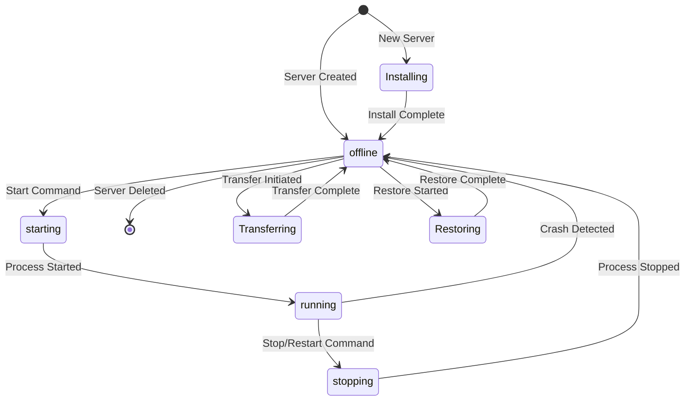
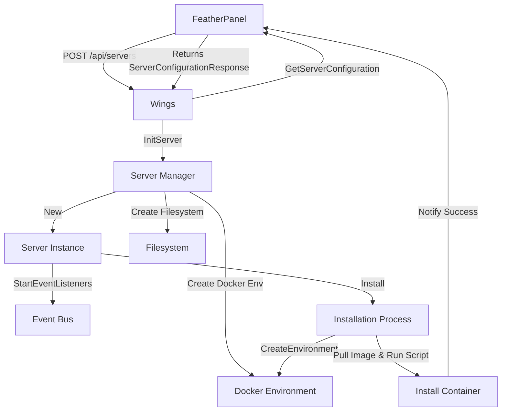
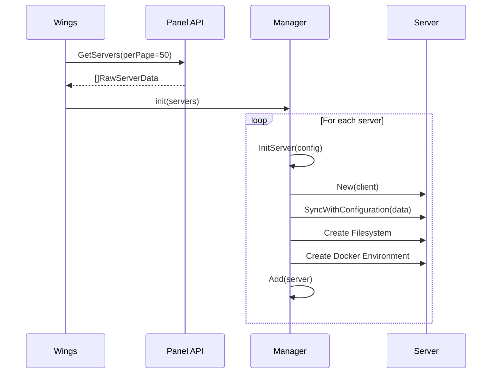
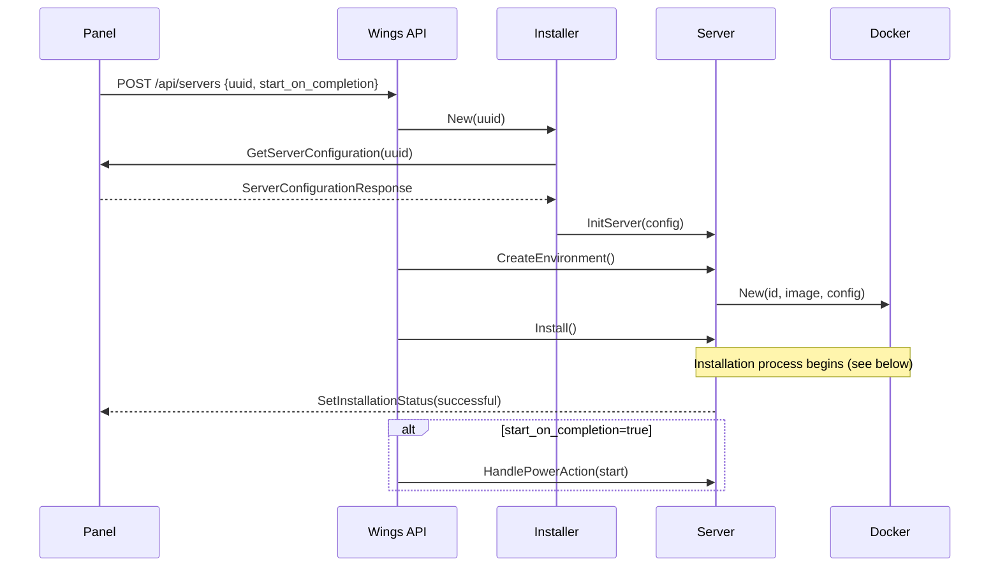
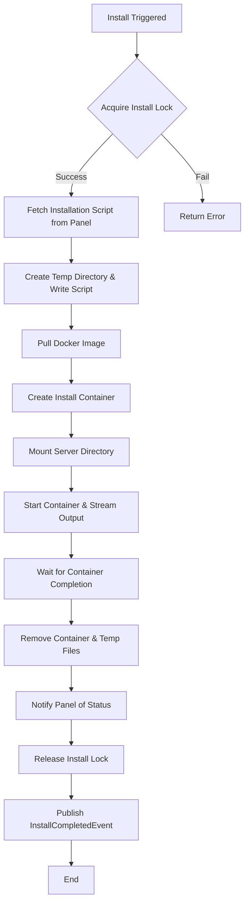
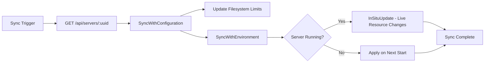
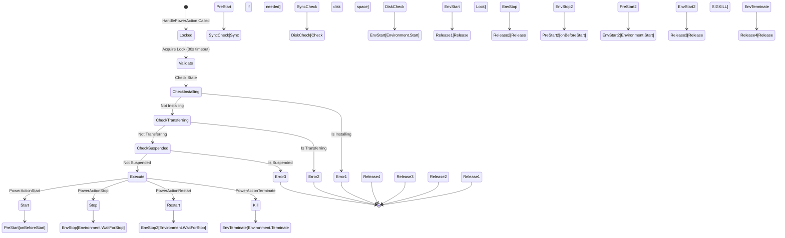
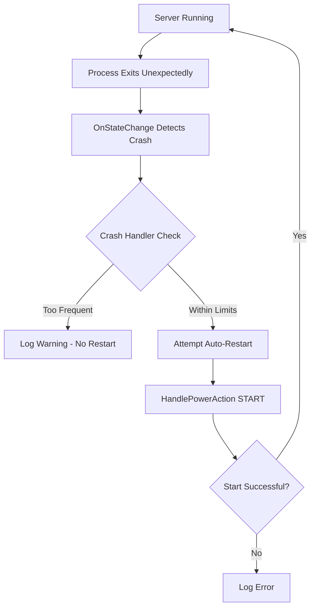
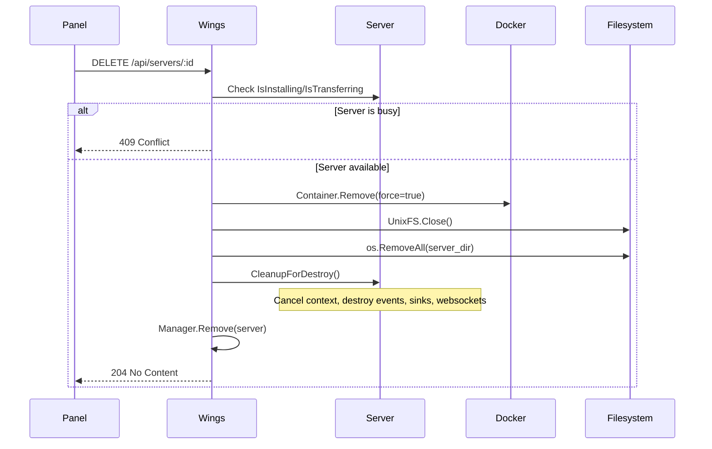
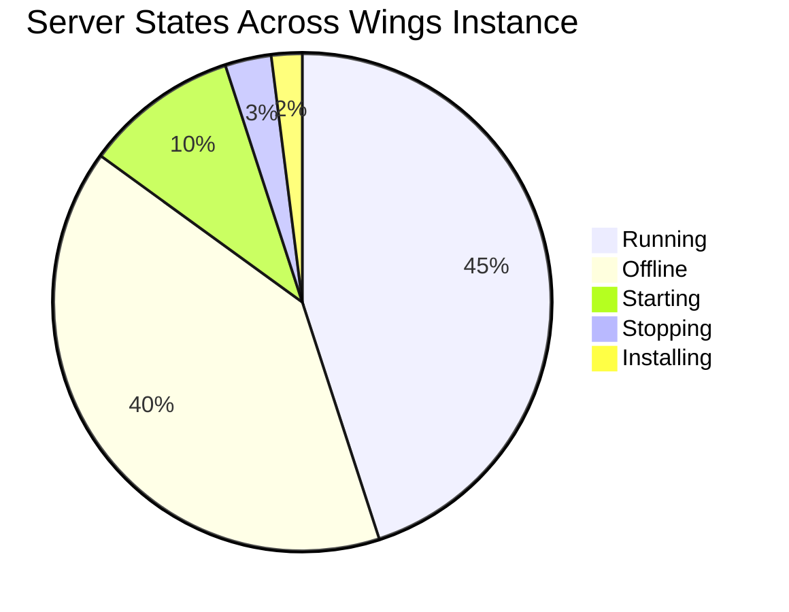

# Server Lifecycle & Management

This document provides comprehensive documentation on server creation, installation, configuration synchronization, lifecycle management, and power control in FeatherWings.

## Table of Contents

- [Overview](#overview)
- [Server States](#server-states)
- [Server Creation Flow](#server-creation-flow)
- [Installation Process](#installation-process)
- [Configuration Synchronization](#configuration-synchronization)
- [Power Management](#power-management)
- [Server Deletion](#server-deletion)
- [API Endpoints](#api-endpoints)
- [Configuration](#configuration)
- [Code References](#code-references)

---

## Overview

FeatherWings manages game server instances through a sophisticated lifecycle system that handles:

- **Initial creation** via Panel API requests
- **Installation** using Docker containers and egg scripts
- **Configuration sync** from the Panel
- **Power management** (start, stop, restart, terminate)
- **Resource monitoring** and crash detection
- **Environment updates** (in-situ resource limit changes)
- **Graceful deletion** and cleanup

---

## Server States

Servers transition through multiple states during their lifecycle:



### Core Process States

| State | Description | Code Constant |
|-------|-------------|---------------|
| **offline** | Server is stopped | `ProcessOfflineState` |
| **starting** | Server is booting up | `ProcessStartingState` |
| **running** | Server is active | `ProcessRunningState` |
| **stopping** | Server is shutting down | `ProcessStoppingState` |

### Special States (Locks)

- **installing**: Server is running installation scripts
- **transferring**: Server is being transferred between nodes
- **restoring**: Server is restoring from backup

---

## Server Creation Flow

### High-Level Architecture



### Step-by-Step Creation Process

#### 1. Wings Boot Sequence

On startup, Wings fetches all servers from the Panel API:



#### 2. Manual Server Creation (via Panel)

When a new server is created in the Panel:



### Configuration Structure

Servers are initialized with configuration from the Panel:

```go
type ServerConfigurationResponse struct {
    Settings             json.RawMessage      // Container, build, env vars, etc.
    ProcessConfiguration ProcessConfiguration // Startup command, stop config
}
```

Key components:
- **Container Image**: Docker image to use (e.g., `ghcr.io/pterodactyl/yolks:java_17`)
- **Build Limits**: CPU, memory, disk, I/O limits
- **Allocations**: Network ports (IP:Port mappings)
- **Environment Variables**: Game-specific variables
- **Egg Configuration**: Startup command, stop signal, file denylist

---

## Installation Process

Installation runs a Docker container with a custom script to prepare the server.

### Installation Flow



### Installation Container Configuration

```yaml
Container:
  Image: <from egg config>
  Cmd: ["/bin/ash", "/mnt/install/install.sh"]
  WorkingDir: /mnt/server
  Mounts:
    - /tmp/featherpanel/<uuid>:/mnt/install  # Install script
    - /var/lib/featherpanel/volumes/<uuid>:/mnt/server  # Server data
  Environment:
    - <all server environment variables>
  Limits:
    Memory: 1024 MB (configurable via installer_limits)
    CPU: 100% (configurable)
```

### Installation Script Execution

1. **GetInstallationScript**: Wings fetches the script from Panel API
2. **Template Processing**: Script is rendered with server variables
3. **Container Creation**: Docker container is created with mounted volumes
4. **Stream Output**: Installation output is streamed to websockets and logs
5. **Completion Check**: Container exit code determines success/failure
6. **Panel Notification**: `SetInstallationStatus(successful, reinstall)` is called

### Reinstallation

Servers can be reinstalled without losing data:

```bash
curl -X POST \
  -H "Authorization: Bearer <token>" \
  https://WINGS_NODE/api/servers/<uuid>/reinstall
```

Process:
1. Stop server if running
2. Sync latest configuration from Panel
3. Run installation process (does NOT delete files)
4. Installation script determines what to update

---

## Configuration Synchronization

Configuration sync keeps server settings up-to-date with the Panel.

### Sync Operations



### Sync Triggers

| Trigger | Endpoint | Description |
|---------|----------|-------------|
| Manual Sync | `POST /api/servers/:id/sync` | Force sync from Panel |
| Reinstall | `POST /api/servers/:id/reinstall` | Sync before reinstalling |
| Startup | Server boot | Sync before starting server |
| Panel Push | (Webhook/event) | Panel pushes config updates |

### In-Situ Updates (Docker)

For running servers, Wings can update resources **without restart**:

- Memory limits
- CPU limits
- Disk limits
- Environment variables (applied on next start)
- Docker labels

```bash
# Example: Panel updates memory from 2GB to 4GB
# Wings immediately applies: docker update <container> --memory=4g
```

---

## Power Management

Servers support multiple power actions with proper locking and state management.

### Power Actions



### Power Action Endpoints

| Action | HTTP Method | Endpoint | Payload |
|--------|-------------|----------|---------|
| Start | POST | `/api/servers/:id/power` | `{"action": "start"}` |
| Stop | POST | `/api/servers/:id/power` | `{"action": "stop"}` |
| Restart | POST | `/api/servers/:id/power` | `{"action": "restart"}` |
| Kill | POST | `/api/servers/:id/power` | `{"action": "kill"}` |

### Power Lock Mechanism

- **Timeout**: 30 seconds by default (configurable per request)
- **Purpose**: Prevents concurrent power actions
- **Behavior**: Returns `ErrLockerLocked` if lock cannot be acquired

### Crash Detection & Auto-Restart



Configuration (`config.yml`):

```yaml
system:
  crash_detection:
    enabled: true
    detect_clean_exit_as_crash: true
    timeout: 60  # seconds between crashes before marking as too frequent
```

---

## Server Deletion

### Deletion Flow



### Cleanup Steps

1. **Stop Processes**: Force stop container
2. **Close Filesystem**: Unmount and close filesystem handles
3. **Delete Data**: Remove `/var/lib/featherpanel/volumes/<uuid>`
4. **Context Cancellation**: Cancel all background tasks
5. **Event Cleanup**: Destroy event bus and websocket connections
6. **Manager Removal**: Remove from active server list

---

## API Endpoints

### System Endpoints

| Endpoint | Method | Description |
|----------|--------|-------------|
| `/api/system` | GET | System information (CPU, memory, kernel) |
| `/api/system/ips` | GET | Host machine IP addresses |
| `/api/system/utilization` | GET | Resource utilization |
| `/api/servers` | GET | List all servers |
| `/api/servers` | POST | Create new server |

### Server-Specific Endpoints

| Endpoint | Method | Description |
|----------|--------|-------------|
| `/api/servers/:id` | GET | Get server details |
| `/api/servers/:id` | DELETE | Delete server |
| `/api/servers/:id/sync` | POST | Sync configuration from Panel |
| `/api/servers/:id/power` | POST | Execute power action |
| `/api/servers/:id/install` | POST | Trigger installation |
| `/api/servers/:id/reinstall` | POST | Reinstall server |
| `/api/servers/:id/logs` | GET | Get console logs |
| `/api/servers/:id/commands` | POST | Send console command |
| `/api/servers/:id/ws` | GET | WebSocket connection |

---

## Configuration

### Key Configuration Sections

#### System Configuration

```yaml
system:
  data: /var/lib/featherpanel/volumes          # Server data directory
  tmp_directory: /tmp/featherpanel              # Temp files for installs
  disk_check_interval: 150                      # Seconds between disk checks
  check_permissions_on_boot: true               # Verify file permissions
  crash_detection:
    enabled: true
    detect_clean_exit_as_crash: true
    timeout: 60
```

#### Docker Configuration

```yaml
docker:
  installer_limits:
    memory: 1024      # MB for install containers
    cpu: 100          # Percentage
  overhead:
    default_multiplier: 1.05  # Add 5% overhead to limits
  container_pid_limit: 512    # Max processes per container
```

#### Remote Query Configuration

```yaml
remote_query:
  timeout: 30                  # API request timeout (seconds)
  boot_servers_per_page: 50    # Servers per page on boot
```

---

## Code References

### Core Files

- **Server Creation**: `server/server.go`, `server/manager.go`
- **Installation**: `server/install.go`, `server/installer/installer.go`
- **Configuration Sync**: `server/update.go`, `server/configuration.go`
- **Power Management**: `server/power.go`
- **Environment Interface**: `environment/environment.go`
- **Docker Environment**: `environment/docker/environment.go`
- **API Router**: `router/router_system.go`, `router/router_server.go`
- **Panel Client**: `remote/http.go`, `remote/servers.go`

### Key Functions

| Function | Location | Purpose |
|----------|----------|---------|
| `Manager.InitServer` | `server/manager.go:186` | Initialize server from Panel config |
| `Server.New` | `server/server.go:85` | Create new server instance |
| `Server.Install` | `server/install.go:35` | Run installation process |
| `Server.Sync` | `server/server.go:238` | Sync config from Panel |
| `Server.SyncWithConfiguration` | `server/server.go:266` | Apply config to server |
| `Server.SyncWithEnvironment` | `server/update.go:21` | Apply config to environment |
| `Server.HandlePowerAction` | `server/power.go:73` | Execute power actions |
| `InstallationProcess.Run` | `server/install.go:180` | Execute install container |

---

## Example Workflows

### Example 1: Create and Install a New Server

```bash
# 1. Create server on Wings
curl -X POST \
  -H "Authorization: Bearer <wings-token>" \
  -H "Content-Type: application/json" \
  https://WINGS_NODE/api/servers \
  -d '{
    "uuid": "8f5c7d9e-4b2a-4f3e-9c1d-6e8a7b9c0d1e",
    "start_on_completion": true
  }'

# Response: 202 Accepted

# 2. Wings automatically:
#    - Fetches config from Panel
#    - Creates filesystem
#    - Creates Docker environment
#    - Runs installation script
#    - Starts server (if start_on_completion=true)

# 3. Monitor via websocket:
wscat -c wss://WINGS_NODE/api/servers/<uuid>/ws \
  -H "Authorization: Bearer <token>"
```

### Example 2: Update Server Resources (Live)

```bash
# Panel updates memory limit from 2GB to 4GB
# Wings receives the update automatically or via sync:

curl -X POST \
  -H "Authorization: Bearer <wings-token>" \
  https://WINGS_NODE/api/servers/<uuid>/sync

# Wings applies the change immediately if server is running
# No restart required!
```

### Example 3: Reinstall Server

```bash
curl -X POST \
  -H "Authorization: Bearer <wings-token>" \
  https://WINGS_NODE/api/servers/<uuid>/reinstall

# Process:
# 1. Stop server
# 2. Sync latest config from Panel
# 3. Run installation script (does NOT delete files)
# 4. Server remains stopped
```

---

## State Distribution (Example)



---

## Troubleshooting

### Server Won't Start

1. Check logs: `curl https://WINGS_NODE/api/servers/<uuid>/logs`
2. Verify disk space: Server requires available disk space
3. Check installation status: Server must complete installation first
4. Verify not suspended: Suspended servers cannot start
5. Check Docker: `docker ps -a | grep <uuid>`

### Installation Fails

1. Check install logs: Available via websocket or Panel
2. Verify Docker image exists and is accessible
3. Check disk space in `/var/lib/featherpanel/volumes`
4. Review installation script for errors
5. Check installer limits: May need more memory/CPU

### Sync Issues

1. Verify Panel connectivity: Check `remote` URL in config.yml
2. Check authentication: Verify `token_id` and `token`
3. Review Wings logs: `/var/log/featherpanel/wings.log`
4. Ensure Panel has correct node configuration

---

## Best Practices

1. **Always use sync before critical operations** (reinstall, major updates)
2. **Monitor crash detection** - adjust timeouts if servers restart legitimately
3. **Set appropriate installer limits** - some games need more than 1GB during install
4. **Use in-situ updates** - leverage live resource changes instead of restarts
5. **Implement proper shutdown** - use stop/restart instead of kill when possible
6. **Monitor disk space** - Wings checks before starting servers
7. **Keep Docker images updated** - use Panel's egg system to manage images

---

*For transfer operations, see [Server Transfers](server-transfers.md)*


