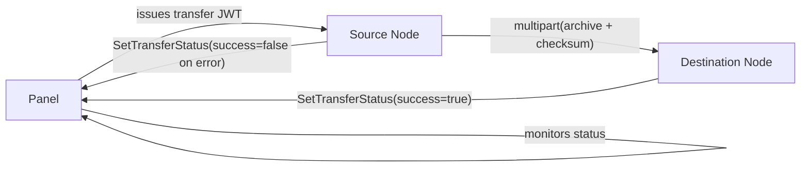
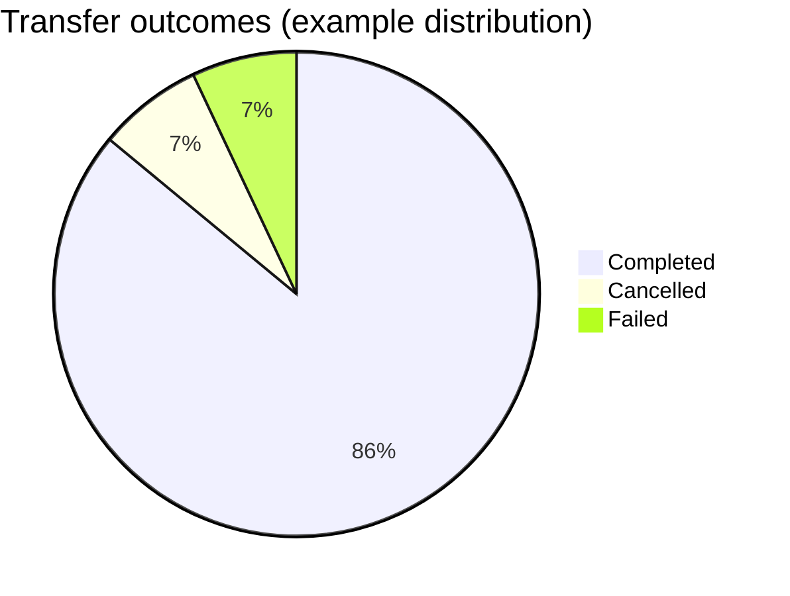

## Server Transfers

This document explains how server transfers work in FeatherWings, including the source and destination flows, configuration, endpoints, tokens, and example requests. It also includes sequence and flow diagrams to visualize the process.

### Overview

- The source node streams a compressed archive of a server's data to the destination node over HTTP multipart form-data.
- Integrity is ensured with a SHA-256 checksum validated by the destination.
- The destination creates or attaches a server instance, extracts files, configures the environment, and reports success to the Panel. The source only reports failures.

### Prerequisites

- A valid transfer JWT issued by the Panel with subject set to the destination server UUID.
- Destination node reachable at its `POST /api/transfers` endpoint via HTTPS.
- Source node has permission to initiate transfer via `POST /api/servers/:id/transfer`.

### Configuration

- `config.yml` relevant keys:
  - `api.ssl.enabled`: enable TLS on the node API.
  - `transfers.download_limit`: limit incoming transfer bandwidth (0 = unlimited).
  - `transfers.perform_checksum_checks`: **enable SHA-256 checksum validation on incoming transfers** (default: `false`).
  - `allowed_origins`: ensure Panel/UI origins are allowed for websockets and CORS, e.g.
    - `- https://featherpanel.mythical.systems`

### High-level architecture



### Sequence of operations

```mermaid
sequenceDiagram
  participant Panel
  participant Source
  participant Destination

  Panel->>Panel: Create transfer JWT (sub = destination server UUID)
  Panel->>Source: POST /api/servers/:id/transfer { url, token="Bearer <jwt>" }
  Source->>Source: Stop server container; mark transferring
  Source->>Destination: POST /api/transfers (multipart: archive, checksum) with Authorization: Bearer <jwt>
  Destination->>Destination: installer.New() -> create/attach server; mark transferring
  Destination->>Destination: Extract archive into server directory; verify SHA-256 checksum
  Destination->>Destination: CreateEnvironment(); successful=true
  Destination->>Panel: SetTransferStatus(uuid, successful=true)
  Source-->>Panel: Only report failures (successful=false)
```

### Panel communication details (in-depth)

- **Remote API base**
  - Wings configures a Panel HTTP client with base URL: `/api/remote` on the Panel (see `remote/http.go`).
  - All calls include:
    - `Authorization: Bearer <token_id>.<token>` (node credentials from `config.yml`).
    - `User-Agent: FeatherPanel Wings/v<version> (id:<token_id>)`.

- **Transfer status updates**
  - **Destination node** (success or failure at the end of an incoming transfer):
    - Calls `SetTransferStatus(ctx, uuid, successful)` on the Panel client, which performs:
      - `POST /api/remote/servers/{uuid}/transfer/success` when `successful=true`.
      - `POST /api/remote/servers/{uuid}/transfer/failure` when `successful=false`.
    - These requests have an empty JSON body and rely on the URL segment (`success` or `failure`) to convey state.
    - Retries with exponential backoff are handled by the shared HTTP client (`remote/http.go`), so transient Panel errors are retried automatically.
  - **Source node** (only on failure while pushing the archive):
    - On any unrecoverable error during `PushArchiveToTarget`, the source node:
      - Marks the server as no longer transferring.
      - Calls `SetTransferStatus(ctx, uuid, false)` → `POST /api/remote/servers/{uuid}/transfer/failure`.
    - The source node never reports success; the destination is the single source of truth for successful transfers.

- **Transfer JWT usage**
  - The **Panel** issues a short-lived JWT used only between nodes (source → destination):
    - `sub` (subject) is set to the **destination server UUID**.
  - **Source node**:
    - Receives this JWT from the Panel as the `token` field in the `POST /api/servers/:id/transfer` payload.
    - Forwards it verbatim in the `Authorization` header when calling the destination:
      - `Authorization: Bearer <transfer_jwt_from_panel>`.
  - **Destination node**:
    - Parses the JWT in `router/router_transfer.go` using `tokens.TransferPayload` and `tokens.ParseToken`.
    - Extracts `Subject` (destination server UUID) from the JWT payload and uses it to:
      - Find or create the correct server instance.
      - Associate the incoming transfer stream with that server.

### Panel-side lifecycle & state model (for integrators)

This section describes **what the Panel should do** around a transfer. The exact field names in your database may differ, but the state machine should follow this shape.

- **Pre-transfer: when user requests a transfer in the Panel**
  - **Validate eligibility**:
    - **Source server**:
      - Not already transferring (e.g. `transfer_status IS NULL` or not in an active state).
      - Not currently installing/restoring in a way that conflicts with a transfer.
    - **Destination target**:
      - Node exists and is healthy.
      - Capacity checks (disk/allocations) pass, according to your Panel rules.
  - **Prepare a destination server record** (DB-level):
    - Either:
      - **Create a new server row** on the destination node with `uuid = <destination_server_uuid>` and a status like `transfer_pending`, or
      - **Attach to an existing server row** marked as “awaiting transfer”.
    - Persist at least:
      - Node identifier (destination Wings).
      - Game/egg/spell/environment metadata needed by `installer.New`.
      - Any transfer metadata (source node id, requested by user id, timestamps).
  - **Update transfer-related flags on Panel side**:
    - E.g. set a logical state such as:
      - `source_transfer_state = "pending"`
      - `destination_transfer_state = "pending"`
      - `ui_transfer_progress = 0`
    - Start any background job used to periodically refresh status from the Panel DB.
  - **Issue transfer JWT**:
    - `sub = <destination_server_uuid>` (must match the destination server record).
    - Short TTL (minutes, not hours) to limit replay/abuse.
    - Audience/issuer aligned with your Panel’s JWT configuration.
  - **Call the source node**:
    - `POST /api/servers/:id/transfer` on the **source Wings** with:
      - `url = https://DEST_NODE/api/transfers`
      - `token = "Bearer <transfer_jwt>"`.
    - On success, mark source-side state as e.g. `source_transfer_state = "started"` and show “Waiting for destination…” in the UI.

- **During transfer: source and destination behavior & how Panel should interpret callbacks**
  - **Source Wings**:
    - Stops the container and marks the server as “transferring” locally.
    - Streams archive → destination using the JWT.
    - If a **fatal error** occurs (network failure, destination 4xx/5xx, context cancellation):
      - Calls `POST /api/remote/servers/{uuid}/transfer/failure`.
      - Panel should:
        - Set `source_transfer_state = "failed"`.
        - Optionally set `destination_transfer_state = "failed"`.
        - Record reason (HTTP status + error body from Wings logs if you surface them).
  - **Destination Wings**:
    - Creates or attaches a server instance using `installer.New` (`uuid = <Subject>` from JWT).
    - Marks server as `transferring` locally and extracts the archive.
    - When the transfer completes (including environment creation), it calls:
      - `POST /api/remote/servers/{uuid}/transfer/success` on success, or
      - `POST /api/remote/servers/{uuid}/transfer/failure` on unrecoverable error.
    - Panel should:
      - On **success**:
        - Set `destination_transfer_state = "success"`.
        - Optionally mark the old (source) server as archived/retired/migrated.
        - Clear any “transferring” flags and allow the destination server to be started from the UI.
      - On **failure**:
        - Set `destination_transfer_state = "failed"`.
        - Leave the source server state unchanged unless/until the operator decides otherwise.
        - Optionally flag partial data on destination for cleanup.

- **Database / state transitions summary (recommended model)**
  - **Panel should maintain at least these conceptual states**:
    - **Source**:
      - `idle` → `transfer_pending` → `transfer_in_progress` → `transfer_failed` or `transfer_completed`.
    - **Destination**:
      - `idle/new` → `transfer_pending` → `transfer_in_progress` → `transfer_failed` or `ready`.
  - **Triggers**:
    - When Panel **starts** the transfer:
      - Sets both source & destination to `transfer_pending` / `transfer_in_progress` as appropriate.
    - When **source** calls `/servers/{uuid}/transfer/failure`:
      - Mark source side as `transfer_failed` and surface reason to the UI.
    - When **destination** calls `/servers/{uuid}/transfer/success`:
      - Mark destination as `ready`.
      - Mark source as `transfer_completed`/`migrated` depending on your semantics.
    - When **destination** calls `/servers/{uuid}/transfer/failure`:
      - Mark destination as `transfer_failed`.
      - Keep source at `idle` or `transfer_failed` depending on whether the source also failed.

- **Failure modes & operator guidance**
  - **Source failure before archive is fully sent**:
    - Only `/transfer/failure` from source is expected.
    - Recommendation: Panel leaves destination server in a “staging failed” state and:
      - Allows retry using the same or a new destination.
      - Offers a “discard destination data” cleanup action.
  - **Destination failure after partial extraction**:
    - `/transfer/failure` from destination.
    - Panel should treat the destination data as **unsafe to start**:
      - Do not auto-start the destination server.
      - Expose error message and logs.
      - Provide an explicit “clean up failed transfer” operation that:
        - Deletes destination data and/or marks the server row as invalid.
  - **Panel receives neither success nor failure (timeouts)**:
    - Implement a **watchdog**:
      - If no callback (success/failure) is received after a configured timeout,
        set both source and destination transfer states to `unknown` or `timed_out`.
      - Show clear UI text that manual operator intervention is required and that
        Wings logs on both nodes should be inspected.

### Panel HTTP timeline (example)

Below is an example sequence as observed from the **Panel** point of view. Exact URLs may vary with your routing, but the shape should be similar.

- **1. User initiates transfer in the Panel UI**
  - Panel (backend) does:
    - Generate destination server UUID and DB row.
    - Generate transfer JWT with `sub = <destination_server_uuid>`.
    - Call **source Wings**:
      - `POST https://SOURCE_NODE/api/servers/{source_id}/transfer`
      - Body:
        - `url = "https://DEST_NODE/api/transfers"`
        - `token = "Bearer <transfer_jwt_from_panel>"`

- **2. Source → Destination streaming (no Panel traffic)**
  - Source Wings:
    - Streams multipart form-data to destination:
      - `POST https://DEST_NODE/api/transfers`
      - Headers:
        - `Authorization: Bearer <transfer_jwt_from_panel>`
        - `Content-Type: multipart/form-data; boundary=...`
      - Parts:
        - `archive`: tar.gz payload.
        - `checksum`: hex-encoded SHA-256 (required only if `transfers.perform_checksum_checks=true` on destination).

- **3. Destination → Panel final status**
  - On success:
    - `POST https://PANEL/api/remote/servers/{destination_uuid}/transfer/success`
  - On failure:
    - `POST https://PANEL/api/remote/servers/{destination_uuid}/transfer/failure`

- **4. Source → Panel failure (only if needed)**
  - If archive push fails:
    - `POST https://PANEL/api/remote/servers/{source_uuid}/transfer/failure`

Panel implementors should wire these callbacks into their own DB schema, following the state model above so the UI and background jobs always reflect the **single source of truth**: the destination node’s final callback. 

### Endpoints

| Role | Endpoint | Method | Purpose |
|---|---|---|---|
| Source | `/api/servers/:id/transfer` | POST | Initiate transfer to destination URL with JWT |
| Source | `/api/servers/:id/transfer` | DELETE | Cancel outgoing transfer |
| Destination | `/api/transfers` | POST | Receive archive stream and checksum, perform install/extract |
| Destination | `/api/transfers` | DELETE | Cancel incoming transfer |

### Request contract

- Source initiation payload:

```json
{
  "url": "https://DEST_NODE/api/transfers",
  "token": "Bearer <transfer_jwt_from_panel>",
  "server": { "uuid": "<server_uuid>" }
}
```

- Destination expects HTTP header `Authorization: Bearer <transfer_jwt>` and multipart form parts:
  - `archive`: binary stream of tar.gz data (required)
  - `checksum`: hex-encoded SHA-256 of the `archive` payload (required **only if** `transfers.perform_checksum_checks` is `true`; ignored otherwise)

### cURL examples

- Initiate transfer from Source:

```bash
curl -X POST \
  -H "Authorization: Bearer <panel-api-token>" \
  -H "Content-Type: application/json" \
  https://SOURCE_NODE/api/servers/<server_id>/transfer \
  -d '{
    "url": "https://DEST_NODE/api/transfers",
    "token": "Bearer <transfer_jwt_from_panel>",
    "server": { "uuid": "<server_uuid>" }
  }'
```

- Cancel outgoing (Source):

```bash
curl -X DELETE \
  -H "Authorization: Bearer <panel-api-token>" \
  https://SOURCE_NODE/api/servers/<server_id>/transfer
```

- Cancel incoming (Destination):

```bash
curl -X DELETE \
  -H "Authorization: Bearer <panel-api-token>" \
  https://DEST_NODE/api/transfers
```

### Operational considerations

- Source stops the server container before archiving to maintain consistency.
- Destination verifies checksum after extraction when `transfers.perform_checksum_checks` is enabled; mismatch aborts the transfer.
- Progress is emitted via server events for UI consumption.
- Only the destination reports success to the Panel; the source reports failure conditions.
- Ensure the `token` field you pass from the source includes the `Bearer ` prefix so the destination parser accepts it.

### Simple status visualization (example)



### Implementation references (source code)

- Router endpoints: `router/router.go`, `router/router_server_transfer.go`, `router/router_transfer.go`
- Transfer internals: `server/transfer/*` (archive streaming, managers, source push)
- Panel client: `remote/http.go` (`SetTransferStatus`)


